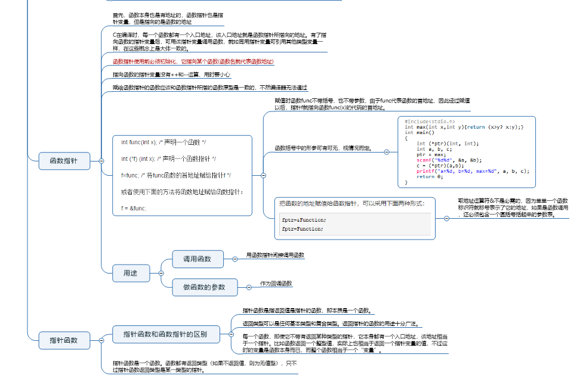
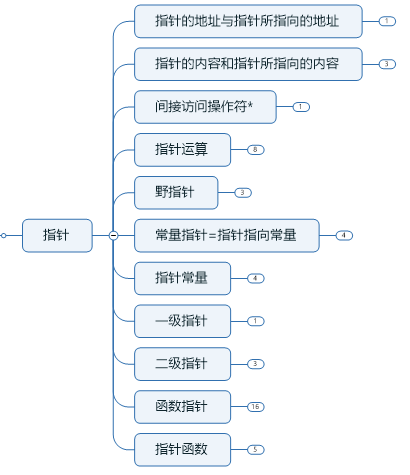
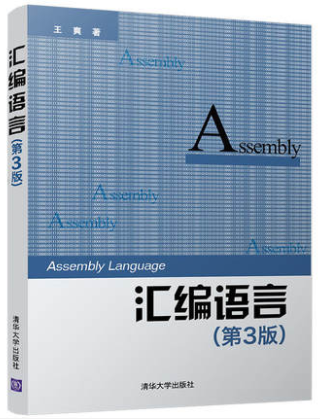
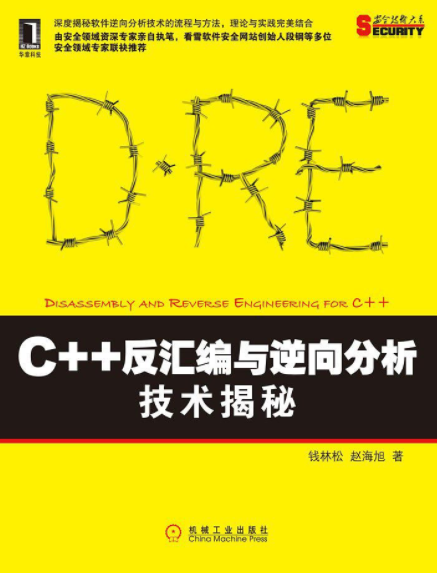
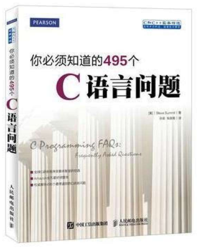
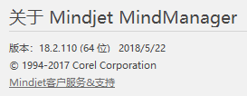
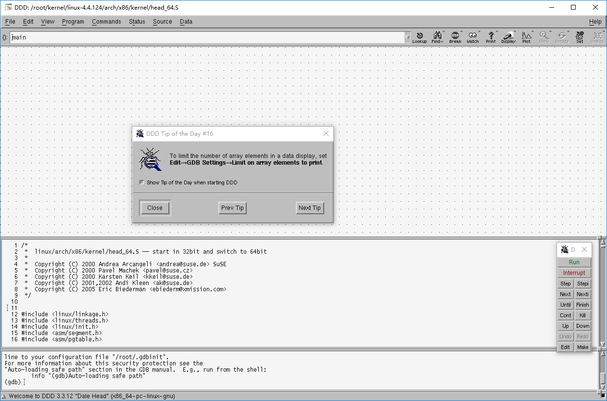

# 汇编C语言

## 本仓库内容

1. 汇编C语言 - 不了解体系结构肿么玩？用汇编学C语言本质
2. C语言相关面试题解析 - 面试官总会问基础滴
3. C语言知识导图-争取覆盖所有知识点

```
Something I hope you know before go into the coding~
First, please watch or star this repo, I'll be more happy if you follow me.
Bug report, questions and discussion are welcome, you can post an issue or pull a request.
```

## 相关站点

* GitHub地址:<https://github.com/yifengyou/learn-c>
* GibBook地址:<https://yifengyou.gitbooks.io/learn-c/content/>

## 目录

* [汇编](docs/汇编/汇编.md)
    * [进制](docs/汇编/进制.md)
    * [数据宽度](docs/汇编/数据宽度.md)
    * [通用寄存器](docs/汇编/通用寄存器.md)
    * [内存读写](docs/汇编/内存读写.md)
    * [寄存器和内存的区别](docs/汇编/寄存器和内存的区别.md)
    * [寻址公式](docs/汇编/寻址公式.md)
    * [汇编中的数据类型](docs/汇编/汇编中的数据类型.md)
    * [EFLAGS寄存器](docs/汇编/EFLAGS寄存器.md)
    * [跳转指令集](docs/汇编/跳转指令集.md)
    * [参数传递](docs/汇编/参数传递.md)
    * [堆栈图](docs/汇编/堆栈图.md)
* [C语言](docs/C语言/C语言.md)
    * [C语言简介](docs/C语言/C语言简介.md)
    * [C语言变量](docs/C语言/C语言变量.md)
    * [运算符](docs/C语言/运算符.md)
    * [优先级](docs/C语言/优先级.md)
    * [表达式和语句](docs/C语言/表达式和语句.md)
    * [内存图](docs/C语言/内存图.md)
    * [sizeof关键字](docs/C语言/sizeof关键字.md)
    * [typedef关键字](docs/C语言/typedef关键字.md)
    * [控制语句-分支和跳转](docs/C语言/控制语句-分支和跳转.md)
    * [控制语句-循环](docs/C语言/控制语句-循环.md)
    * [数组](docs/C语言/数组.md)
    * [函数](docs/C语言/函数.md)
    * [结构体](docs/C语言/结构体.md)
    * [联合类型](docs/C语言/联合类型.md)
    * [枚举类型](docs/C语言/枚举类型.md)
    * [指针](docs/C语言/指针.md)
    * [字符数组与字符串](docs/C语言/字符数组与字符串.md)
    * [常量区](docs/C语言/常量区.md)
    * [位运算](docs/C语言/位运算.md)
    * [预编译](docs/C语言/预编译.md)
    * [宏定义](docs/C语言/宏定义.md)
    * [头文件](docs/C语言/头文件头文件.md)

## 思维导图






## 参考书籍







## 参考教程

滴水论坛汇编C语言C++基础原理教程:<https://chuanke.baidu.com/v1911416-189554-1078110.html>

## 神器安利

### Mindjet Mindmanager




### 宇宙最强调试器ddd



## 总结

```
1. 懂汇编的娃才能学好C语言~
2. 基础永远值得花费90%的精力去学习加强~
3. 思维导图真特么学习记忆神器~
```
