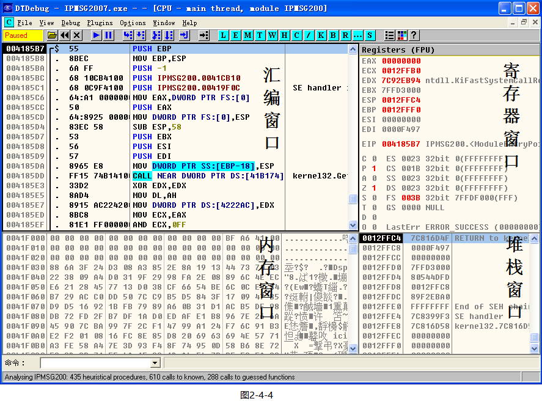
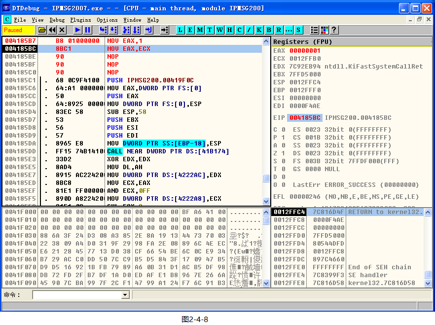

# DTdebug调试器

DTdebug(VT-O) V1.0.025版

出品单位：昆山滴水信息技术有限公司

下载地址链接：链接：<https://pan.baidu.com/s/1YdlezXU-aMUlim3jRcn_Sw>

提取码：6x1j

站点 : <https://www.bcdaren.com/download.html>

**学习仅需使用DTdebug.exe调试器即可，无需打开使用VT引擎。**

产品图片：

产品详细介绍滴水单机VT调试器（DTdebug(VT-O)）V1.0是由VT引擎 DTSettings和DTDebug调试界面两部分组成，为单机3环调试器。DTdebug(VT-O)V1.0利用VT技术制作强大的VT调试引擎，采用类似ollydbg调试界面。继承并改进了ollydbg的所有功能。DTdebug(VT-O)V1.0主要的功能区别在于很难被反调试、反跟踪程序所发现，解决了不能调试带有反调试保护程序的障碍。这款调试器成功推出必将大大提高了分析此类程序的效率。

## 产品组成

1、 滴水单机VT调试器软件V1.0分VT引擎DTSettings和DTDebug调试界面两部分，VT引擎默认状态“未启动”。

2、 滴水单机VT调试器软件V1.0调试界面兼容ollydbg自带插件，同时也兼容多数ollydbg第三方插件。带驱动保护的第三方插件不能用来调试带有反调试保护功能的程序。

## 核心技术

滴水单机VT调试器软件V1.0之所以具备上述强大功能，其核心技术在于：利用 CPU 的VT功能，无需更改INT3、INT1,并监控DR0-DR7寄存器，从而实现其调试功能。

## 功能

1、单机3环VT调试器；

2、可以过所有anti程序-目前尚未发现不能调试的anti程序；

3、DTDebug调试界面具备和OD一样便捷的调试界面和功能，使用方法相同；

4、支持OD多数插件-不带驱动保护的插件皆可支持；

5、支持WINHEX、任务管理器、注册表编辑器，查看、修改隐藏进程或隐藏键值，具备dump、搜索字符串等功能；

6、支持内存断点；

四、安装环境

1、安装机器CPU为Intel或AMD VT CPU,强烈建议采用AMD CPU；

2、必须安装指定WindowsXP XPSP1、XPSP2、XPSP3原版操作系统，禁止安装任何其他改版操作系统；

## 使用说明

（一）、安装：

1、安装机器CPU为Intel或AMD VT CPU,强烈建议采用AMD CPU；

2、必须安装指定WindowsXP XPSP1、XPSP2、XPSP3原版操作系统，禁止安装任何其他改版操作系统；

（二）、使用：

1、程序分VT引擎DTSettings和DTDebug调试界面两部分，VT引擎默认状态“未启动”；

2、DTDebug调试界面与ollydbg相同，按ollydbg使用方法正常调试即可；

3、调试步骤为：

a、打开引擎DTSettings配置界面；

b、输入产品序列号；

c、启动VT引擎，关闭引擎DTSettings配置界面；

d、启动被调试程序；

e、在安装目录下打开DTDebug调试界面开始调试,DTDebug调试界面可复制到其他任意目录下运行；

f、如需使用插件，请打开DTDebug调试界面“Options\Appearance\Directories”配置界面设置UDD路径和插件路径。路径设置完成后退出DTDebug调试界面，重新打开后即可使用。默认状态只保存2个插件，如需使用其他插件，请从“备用插件”文件夹中复制到 “Plugins”文件夹。如需使用其他第三方插件请将该插件发送给滴水客服，修改后方可使用。

4、WinHex使用方法：打开WinHex界面，点击Tools菜单/OPen RAM...打开Edit Main Menory界面后,查找双击目标进程，打开后可以dump代码，点击Search菜单搜索字符串。

## 适用范围

滴水单机VT调试器软件V1.0适用于：软件研发企业、事业单位、软件高等教育机构、科学院所及软件实验室等软件调试、逆向工程。
