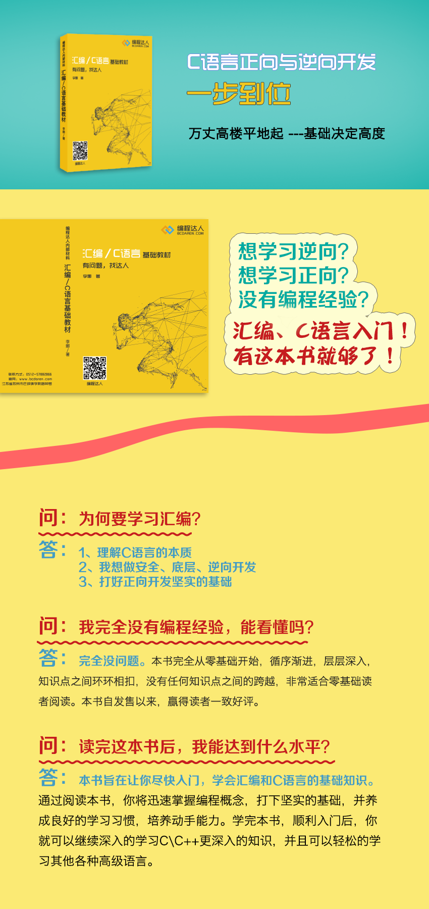

# 汇编、C语言基础教程

* 站点 : <https://www.bcdaren.com/>

## 前言
在写这篇前言之前，首先非常感谢多年以来一直关心和支持滴水的朋友们，同时也非常感谢那些不停的鞭策我们勇往直前的批评者。在你们的掌声与谩骂声中我们一路走来。

2008年滴水公司成立之日起，我们就面临着一个非常严峻的现实，巨大的工作量无人可以分担。既招不到合适的程序员，也找不到愿意同行的伙伴。在孤独与寂寞中我们慢慢的爬行。。。。。。

国内有不计其数的计算机专业毕业生，但是真正的程序员却少之又少。大量院校开办计算机专业，而真正酷爱编程的学习者却无处求学。只有少数人通过自学成为真正合格的程序员。业内的很多人其实都知道原因。大学缺乏合格的计算机专业老师，只会照本宣科、没有工程实践的老师永远也教不出合格的程序员。而真正经验丰富、适合做老师的程序员又没有教书育人的机会。现实需要有人能够改变这种不合理的现状。

2011年经过深思与熟虑，滴水决定暂时放下产品开发，开办逆向培训。我们要做一些有意义的事情。即使我们是大海中的一滴水，也可以荡起一点点的涟漪。知行合一，立刻行动才是我们所需要的！

首先介绍一下滴水逆向培训的主讲老师-唐老师。2000年毕业于西北一所不知名的大学，贸易经济专业毕业—似乎资深的程序员大多非计算机专业出身。有着10年以上的编程经验，取得过计算机软件发明专利，业内公认的杰出程序员。唐老师是滴水硬件调试器和VT调试器的开发者，成功逆向虚拟机VMWare、加壳软件Themida和VMProtect，并即将完成滴水动态变形壳的开发。

接下来说明一下本教程的编写历程。滴水逆向培训基础教程是唐老师自学成才的学习历程以及10多年软件开发经验的总结，并经过滴水逆向培训前几期的讲课实践整理编辑而成。以此让更多无法参加实地培训又渴望学习的人一起分享我们的经验。

在此需要说明的是此教程不同于我们以往常见的教材。为了尽可能的保持唐老师教学的原貌，本教程采用语录+章节体的风格编辑整理而成。先引述唐老师的讲课内容，然后再添加学生实际学习中整理、消化吸收的历程。为读者尽可能的创造一种身临其境、置身其中的学习氛围，共同探讨和学习本教程的内容。由于个人天赋的差异，以及文字表达的局限性，每个读者可能都会有不同的理解，甚至有些比较深奥的地方难以理解。这都是正常的，即使参加实地培训的学员相互之间也存在着巨大的差距。在此只能靠每个读者细心的领悟。同时，由于编写的时间过于仓促，教程本身可能存在诸多错误，希望读者多多批评指正，我们将在后续版本中不断的加以纠正和完善。

最后，我们需要特别强调学习本教程的注意事项：
适合的读者：本教程适合于任何有志于从事编程的读者，包括零基础在内。零基础可能会比较吃力，但有志者事竟成！
教学的目的：帮助零基础的人跨过计算机门槛，为有志于从事计算机编程工作的读者打下坚实的基础。培养独立的自学能力。
学习效果：打下坚实的基础知识，可以独立学习任何自己感兴趣的东西。

学习的前提条件：一是数学要好；数学知识的掌握程度反映一个人的逻辑思维能力，这是学习编程的必备条件，否则会在后续的学习中非常吃力，难以达到预期的学习效果。如果你初中数学优异基本就可以证明具备一定的逻辑思维能力了。二是有兴趣；兴趣是最好的老师。如果这不是你终身希望做的事，学习本教程将是一件非常枯燥无味的事，最终会放弃的。三是肯用功；即使你的智商超过爱因斯坦也不能确保你一定成绩优异，天才+勤奋才是成功的秘诀。补充说明一点，学习编程和英语水平没有必然联系。因为编程涉及的英语单词有限，看的次数多了自然记得。

学习方法：勤学+苦练。练习到手都麻了为止。反复的练习是最佳的捷径，偷懒是你最大的敌人。任何人概莫能外，切记！我们将会在每一章节安排必要的练习，千万不可以偷懒。

教学内容及顺序：几乎所有教材的知识内容大致都是相同的，但是最后学习的效果却有天壤之别，很大一部分原因在于学习的顺序。正确的教学顺序才能让我们在计算机浩如烟海的知识体系中找到正确的方向，循序渐进的消化和吸收才可以真正掌握所学习的内容。大学计算机教育的失败很大一部分原因在于教学内容和顺序的安排错误。表面上所有的内容都已经学过了，但是学完之后全部都忘了，一无所获。过多的学习内容只会让学生望而却步、疲于应付。在没有很好的消化吸收前段学习内容的情况下，继续填鸭式的学习新的内容，割裂了各个知识点之间的联系，最终导致学习失败。所以我们要求，在没有充分掌握前一段知识的情况下，不要继续学习后续的内容。希望能够引以为戒。本教程的教学内容抛弃了知识体系中大量多余的内容，只讲述必要的内容，并进行有效的穿插，帮助读者把每个知识点前后联系起来，并最终牢牢的记住。这是我们所坚持的正确的教学安排，特意为之。学习完本教程，打下一定的基础之后，就可以根据自己的爱好和工作要求自学完成本教程之外暂时没有教授的知识了。所以教程没有涉及过多的应用知识，这是我们有意安排的。学完本教程，打好基础之后，其他的应用知识可以自学完成。基础决定一切。挖多深的地基才能盖多高的楼。这就是我们为什么从汇编开始的原因。只有从底层的汇编开始学起，才是唯一正确的方法。汇编基础打好之后，其他知识就会学的越来越轻松。

此外，由于时间的限制，我们将会在编辑教程中引用其他优秀教材的部分内容，在此向他们表示诚挚的敬意！

最后再次感谢支持和鞭策滴水的朋友们，感谢滴水员工胡雨和陶捷为编写本教程所付出的辛勤工作。我们将在实际教学中不断完善本教程，对于一些自学能力相对较弱的读者，欢迎在情况允许的情况下报名参加滴水逆向实地培训。如果在学习本教程过程中遇到难以理解的问题也可以登录滴水论坛与大家一起探讨，我们将尽可能的给予解答。滴水官网地址：www.dtdishui.com;论坛地址：www.dtdebug.com；谢谢！

昆山滴水信息技术有限公司
2013年1月8日

## 序言

2012年至今，在培训的路上我们已经摸索了整整5年。线下到线上的教学模式的转变，课程体系的完善，教学流程的优化，教师团队的建设，有过无数次的经验和教训。想做好一件真正有意义的事情并不是一件轻松的事情。我们还会继续努力，打造一个为所有程序员服务的开放平台----编程达人。分享知识，获得回报，一对一的答疑服务，原创内容分享，项目接单，在线教育，软件售卖，社交人才服务等。

从一个什么都不懂的初学者，到成功迈进程序员职业生涯，会是一个相对比较枯燥而又艰难的过程。

从教学的角度来分析；

1、课程体系不够完善，知识点之间衔接的不是很好，遇到较大点的坑，学生无法跨越；

2、教学模式非常重要。编程知识浩如烟海，死记硬背的填鸭模式永远都无法让你真正上岸；

3、枯燥无味的教学方法，漫长的学习过程，在考验我们每一个人的意志；

4、缺乏既有丰富项目实战经验又擅长讲解的优秀讲师；

5、没有完整的教学闭环。传道、授业、解惑，主动学习的过程是必不可少的。

从学生的角度来分析：

1、偷懒，不做练习，不勤于动手；

2、自我感觉良好，浅尝辄止，不求甚解，积重难返；

3、浮躁，不严格按照正确的学习方法和顺序学习；

4、没有及时的纠正错误；

5、没有养成良好的学习习惯，预习、练习、复习、记笔记；

6、确实没有程序员必备的逻辑思维能力。

我们虽然认识到了为什么学不会编程的原因，但是真正彻底解决这些问题，还需要我们付出艰苦努力和巨大工作量。根据几年教学经验的摸索和积累，我们完成了知识点、课件、练习的标准化和系统化。形成一套完整的汇编、C语言\C++基础课程的知识体系。结合游戏教学，增加学习的乐趣和积极性主动性。兴趣是最好的老师。线上教学的模式也基本定型。课前预习标准化的知识点视频，提前完成作业练习，作业点评，课前辅导，最后才是网络课堂，老师讲解重点，解决遗留问题，并且拓展知识面和项目实战。形成完整的教学闭环，培养学员积极主动的学习态度和正确的学习方法，彻底摒弃填鸭式的教学。

本书是爱达人出版的第一本教材，也是继2014年发售第一版滴水内部教材之后的第二版《汇编\C语言基础教材》。本书吸取了几年来的教学经验，也借鉴了外面非常优秀的专业书籍的优点。书中尽可能详尽的引用了代码和图例来说明，从正向和逆向两个角度系统的学习汇编和C语言基础知识，是一本非常贴心的汇编、C语言入门教材。同时鉴于语言文字和图片的局限性，希望大家对照教材勤加练习的基础上，欢迎到编程达人的官网和APP点播对应的教学视频，参与互动问答，我们会有专业的老师一对一的帮助大家解决一些学习中的困惑。从而会取得更好的学习效果。

在此我代表爱达人公司感谢本书的作者李娜付出的辛勤劳动，感谢编程达人的诸位老师，感谢所有支持帮助我们成长的朋友们。

王Sir

2018年5月21日于长沙
